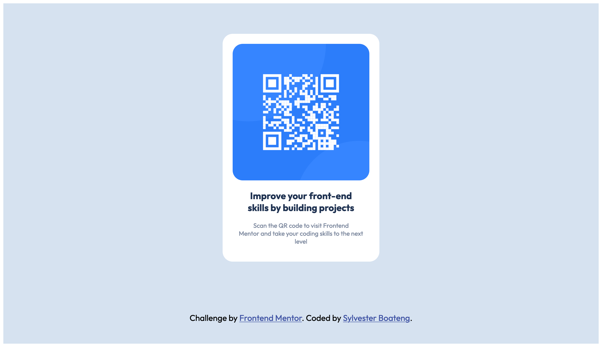

# QR-code-component

# Frontend Mentor - QR code component solution

This is a solution to the [QR code component challenge on Frontend Mentor](https://www.frontendmentor.io/challenges/qr-code-component-iux_sIO_H). Frontend Mentor challenges help you improve your coding skills by building realistic projects.

## Table of contents

- [Overview](#overview)
  - [Screenshot](#screenshot)
  - [Links](#links)
- [My process](#my-process)
  - [Built with](#built-with)
  - [What I learned](#what-i-learned)
  - [Continued development](#continued-development)
  - [Useful resources](#useful-resources)
- [Author](#author)
- [Acknowledgments](#acknowledgments)

## Overview

### Screenshot

### Links

- Solution URL: (https://github.com/sboateng12/QR-code-component.git)
- Live Site URL: (https://sboateng12.github.io/QR-code-component/)

## My process

### Built with

- Semantic HTML5 markup
- CSS custom properties
- Flexbox
- CSS Grid
- Mobile-first workflow

### What I learned

I learned that sometimes it's not about using a lot of Divs in your HTML. I started using divs which i really struggled to style it before i decided to use Main and Section element which was quiet simplier and straightforward.

### Continued development

I'll have to learn more on CSS and master it very well before I move on to Javascript and other languages.

### Useful resources

- [The Odin Project](https://www.theodinproject.com/) - This is an amazing article which helped me finally understand XYZ. I'd recommend it to anyone still learning this concept.

## Author

- Website - [Sylvester Boateng](https://github.com/sboateng12/QR-code-component.git)
- Frontend Mentor - [@sboateng12](https://www.frontendmentor.io/profile/sboateng12)
- Twitter - [@sboateng76](https://twitter.com/sboateng76)

## Acknowledgments

I will like to thank the whole of Frontend Mentor Team for an amazing work they're doing out there and also to thank the Odin Project team for their hardwork.
